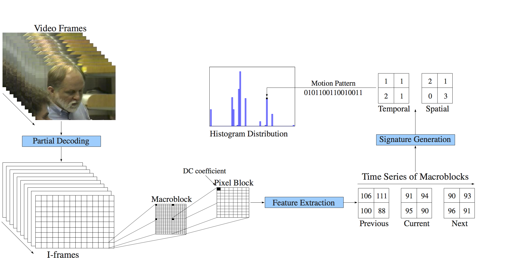

# Comparison of Video Sequences with Histograms of Motion Patterns   
[Jurandy Almeida](http://www.ict.unifesp.br/jurandy/), 
[Neucimar J. Leite](http://www.ic.unicamp.br/~neucimar/),
[Ricardo da S. Torres](http://www.ic.unicamp.br/~rtorres/).
In [ICIP, 2011](https://doi.org/10.1109/ICIP.2011.6116516). 
[[Project Page]](https://gibis.unifesp.br/jurandy/projects/hmp/)

  

## Overview
This is a reimplementation of Histograms of Motion Patterns (HMP) in [Python](https://www.python.org/).

<b>We provide a python wrapper that directly takes a compressed video and returns the HMP representation as a numpy array</b>. 

## Using HMP

Please see [`GETTING_STARTED.md`](GETTING_STARTED.md) for details and instructions.

## Citation
If you find this code useful for your resesarch, please use the following BibTeX entry.
<pre>
@inproceedings{almeida2011hmp,
  title={Comparison of Video Sequences with Histograms of Motion Patterns},
  author={Jurandy Almeida and Neucimar J. Leite and Ricardo da S. Torres},
  booktitle={ICIP},
  pages={3673--3676},
  year={2011}
}
</pre>
